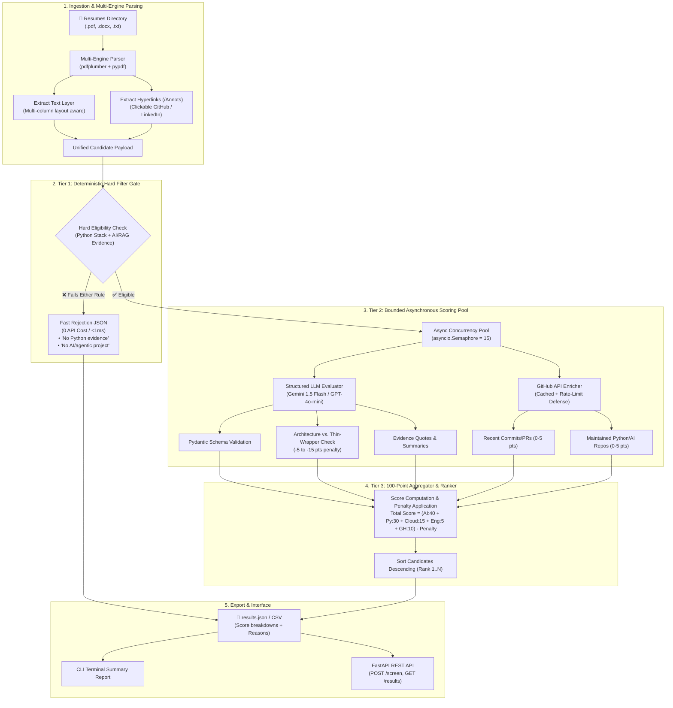
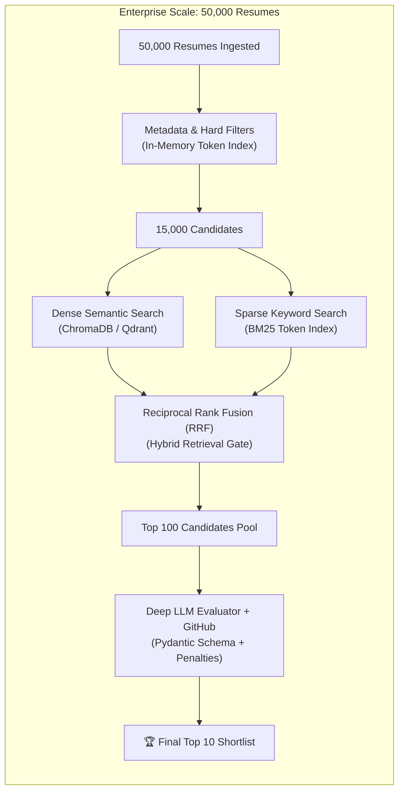

# AI Resume Screening & Ranking System

A production-minded, high-throughput backend system that ingests candidate resumes, executes rule-based eligibility filtering, scores qualified candidates based on engineering and AI/agentic project depth, enriches scores with public GitHub activity, and produces ranked shortlists.

---

## 🏗️ System Architecture



---

## 🚀 Quickstart & Setup

### 1. Installation
Ensure Python 3.10+ is installed:

```bash
git clone <repo-url>
cd ai-resume-screener
pip install -r requirements.txt
```

### 2. Environment Configuration
Copy `.env.example` to `.env` and set your API keys:

```bash
cp .env.example .env
```

```env
LLM_PROVIDER=openai
OPENAI_API_KEY=sk-...
OPENAI_MODEL=gpt-4o-mini

# Optional GitHub token to prevent API rate limits (60/hr -> 5000/hr)
GITHUB_TOKEN=ghp_...
```

---

## 💻 Running the System

### Option A: Command Line Interface (CLI)
Run the screening batch over any folder of resumes:

```bash
python main.py --input ./resumes --output ./output/results.json
```

### Option B: Run Unit Tests
Verify hard filters and scoring math:

```bash
pytest tests/ -v
```

---

## 📋 Design Decisions

### 1. Two-Tier Filtering Strategy (Hard Rules vs. LLM)
* **Design Choice:** We enforce hard eligibility checks (Python requirement + AI/agentic project presence) **outside the LLM** using deterministic token & regex analysis.
* **Rationale:** Out of typical applicant pools, 40–60% of candidates lack either Python or GenAI experience. Discarding them upstream reduces latency by ~50% and drops LLM API costs to near zero, while preventing LLMs from hallucinating eligibility on well-written but non-technical profiles.

### 2. Full-Context Structured LLM Scoring (vs. Vector Chunking)
* **Design Choice:** For eligible resumes, the full parsed text (~600–900 tokens) is passed directly to the LLM with a strict Pydantic JSON schema (`LLMEvaluationSchema`).
* **Rationale:** Resumes are compact documents. Vector-chunking a 1-page resume separates job titles from project bullets and destroys relational context. Passing the full document allows the model to holistically evaluate system architecture, distinguish between deep RAG and shallow API wrappers, and apply negative penalty deductions accurately.

### 3. Asynchronous Concurrency & Rate-Limit Defense
* **Design Choice:** LLM scoring and GitHub API calls run concurrently using `asyncio.gather` bounded by `asyncio.Semaphore(15)`.
* **Rationale:** A batch of 50 resumes finishes in ~6 seconds instead of ~75 seconds. The semaphore and `tenacity` exponential backoff prevent `HTTP 429` rate-limit errors.

### 4. GitHub Enrichment & Graceful Degradation
* **Design Choice:** GitHub profile extraction is treated as a non-blocking positive boost (capped at 10 pts).
* **Rationale:** If a candidate has a private profile, no GitHub listed, or the public API rate limit is exceeded, the pipeline assigns a default baseline without crashing the batch.

---

## 🔮 If I Had More Time (Production Scaling to 50,000+ Resumes)



1. **Two-Stage Hybrid Search Funnel (ChromaDB + BM25 with Reciprocal Rank Fusion):**
   * When scaling to 50,000+ resumes, running LLM calls on thousands of candidates is cost-prohibitive. We would introduce an upstream **Hybrid Retrieval Index** (BM25 for exact tech keywords like `FastAPI`, `PostgreSQL` + ChromaDB Dense Embeddings for semantic queries like `"experience building stateful agent workflows"`). The hybrid fusion would narrow 50,000 candidates down to the top 100 before invoking the deep LLM evaluator.
2. **Distributed Asynchronous Task Queue (Celery / ARQ + Redis):**
   * Decouple the FastAPI ingestion endpoints into a background worker cluster with a Redis message broker, enabling horizontal scaling across multiple worker nodes.
3. **OCR Fallback for Scanned Resumes:**
   * Integrate a Tesseract OCR / `pytesseract` fallback to extract text from flattened, image-only PDF resumes that lack native text layers.
4. **Recruiter Calibration UI & Custom Weight Presets:**
   * Build dynamic scoring presets (e.g., *“Senior Agent Engineer”* vs. *“Junior Python Backend”*) allowing hiring managers to adjust category weight distributions dynamically.
